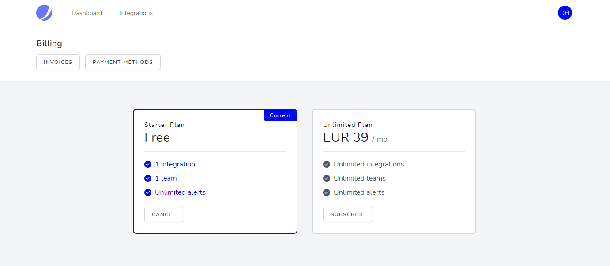

Jetstream Cashier Billing Portal
================================


[](https://codecov.io/gh/renoki-co/jetstream-cashier-billing-portal/branch/master)
[](https://github.styleci.io/repos/320252661)
[](https://packagist.org/packages/renoki-co/jetstream-cashier-billing-portal)
[](https://packagist.org/packages/renoki-co/jetstream-cashier-billing-portal)
[](https://packagist.org/packages/renoki-co/jetstream-cashier-billing-portal)
[](https://packagist.org/packages/renoki-co/jetstream-cashier-billing-portal)

Jetstream Cashier Billing Portal is a simple Spark alternative written for Laravel Jetstream. It comes with built-in stacks and design files for easy scaffolding.

**Currently, only Inertia with Stripe are supported. For Livewire, any PR is welcomed!**



- [Jetstream Cashier Billing Portal](#jetstream-cashier-billing-portal)
  - [🤝 Supporting](#-supporting)
  - [🚀 Installation](#-installation)
    - [Cashier](#cashier)
    - [Scaffolding](#scaffolding)
    - [Stripe Checkout](#stripe-checkout)
    - [Defining Plans](#defining-plans)
  - [🙌 Usage](#-usage)
    - [Custom Billables](#custom-billables)
    - [Modifying the actions](#modifying-the-actions)
    - [Proration Between Swaps](#proration-between-swaps)
    - [Further reading](#further-reading)
  - [🐛 Testing](#-testing)
  - [🤝 Contributing](#-contributing)
  - [🔒  Security](#--security)
  - [🎉 Credits](#-credits)

## 🤝 Supporting

Renoki Co. on GitHub aims on bringing a lot of open source projects and helpful projects to the world. Developing and maintaining projects everyday is a harsh work and tho, we love it.

If you are using your application in your day-to-day job, on presentation demos, hobby projects or even school projects, spread some kind words about our work or sponsor our work. Kind words will touch our chakras and vibe, while the sponsorships will keep the open source projects alive.

[](https://ko-fi.com/R6R42U8CL)

## 🚀 Installation

This package assumes you have installed Jetstream in your project. If not, head over to [Jetstream website](https://jetstream.laravel.com) for installation steps.

### Cashier

Make sure to have installed Cashier as explained in the [Cashier documentation](https://laravel.com/docs/8.x/billing), including the billable traits and tables, because Jetstream Cashier Billing Portal **WILL NOT** install them for you.

### Scaffolding

You can install the package via composer:

```bash
composer require renoki-co/jetstream-cashier-billing-portal
```

You shall install the Cashier Billing Portal in one command, just like Jetstream. This will install Cashier, Cashier Register and Billing Portal.

```bash
$ php artisan billing-portal:install inertia stripe
```

### Stripe Checkout

Starting with [Laravel Cashier v12.7.0](https://github.com/laravel/cashier-stripe/releases/tag/v12.7.0), you can now use Stripe Checkout for easier implementation. Jetstream Cashier Billing Portal supports this and will send the user directly to the Checkout portal for new subscriptions.

Starting with package version 2.x, you will also need to set up [Stripe Webhooks](https://laravel.com/docs/master/billing#handling-stripe-webhooks) in your own project to benefit from Stripe Checkout, that is used by default. If not, check the `1.x` branch or `1.x` releases that do not use Stripe Checkout.

The only thing you should do is to add the [Stripe Javascript SDK code](https://stripe.com/docs/js/including) **before** the `app.js` import in your `app.blade.php` file:

```html
<script src="https://js.stripe.com/v3/"></script>
<script src="{{ mix('js/app.js') }}" defer></script>
```

### Defining Plans

You will also have to [prepare the plans](https://github.com/renoki-co/cashier-register#preparing-the-plans) in `CashierRegisterServiceProvider`.

Manual import of the `app/Providers/CashierRegisterServiceProvider` class is no longe required. The install commandd did that for you.

Below you will find plenty of examples.

## 🙌 Usage

In `BillingPortalServiceProvider`'s boot method you may define the plans you need:

```php
use RenokiCo\CashierRegister\BillingPortalServiceProvider as BaseServiceProvider;
use RenokiCo\CashierRegister\Saas;

class BillingPortalServiceProvider extends BaseServiceProvider
{
    /**
     * Boot the service provider.
     *
     * @return void
     */
    public function boot()
    {
        parent::boot();

        // Define plans here.
    }
}
```

By default, the subscriptions are accessible under `/billing`, but you can change the `/billing` prefix easily in `config/billing-portal.php`.

For more information about defining plans and quotas, check [Cashier Register documentation](https://github.com/renoki-co/cashier-register) and check [Laravel Cashier for Stripe documentation](https://laravel.com/docs/8.x/billing) on handling the billing.

### Custom Billables

By default, the billing is made directly on the currently authenticated model. In some cases like using billable trait on the Team model, you may change the model that will be retrieved from the current request. You may define it in the `boot()` method of `BillingPortalServiceProvider`:

```php
use Illuminate\Http\Request;
use RenokiCo\BillingPortal\BillingPortal;

class BillingPortalServiceProvider extends BaseServiceProvider
{
    /**
     * Boot the service provider.
     *
     * @return void
     */
    public function boot()
    {
        parent::boot();

        BillingPortal::resolveBillable(function (Request $request) {
            return $request->user()->currentTeam;
        });
    }
}
```

### Modifying the actions

Even if the scaffolding comes with basic controller logic to handle new subscriptions or manage existing ones, you are free to change the Billing Portal's actions in `app/Actions/BillingPortal`.

You just have to re-write your logic in the action classes.

### Proration Between Swaps

By default, Billing Portal prorates the swap between plans. If you wish to not prorate the subscription between swaps, you can specify this in your service provider:

```php
use RenokiCo\BillingPortal\BillingPortal;

class BillingPortalServiceProvider extends BaseServiceProvider
{
    /**
     * Boot the service provider.
     *
     * @return void
     */
    public function boot()
    {
        parent::boot();

        BillingPortal::dontProrateOnSwap();
    }
}
```

### Further reading

Because Jetstream Cashier Billing Portal is written on top of [Cashier Register](https://github.com/renoki-co/cashier-register), a complete subscription manager for your Laravel application, you are free to follow the Cashier Register examples in the repository.

You are free to leverage the power of subscriptions in your app. Billing Portal just makes it easier for your app to handle subscriptions.

## 🐛 Testing

``` bash
vendor/bin/phpunit
```

## 🤝 Contributing

Please see [CONTRIBUTING](CONTRIBUTING.md) for details.

## 🔒  Security

If you discover any security related issues, please email alex@renoki.org instead of using the issue tracker.

## 🎉 Credits

- [Alex Renoki](https://github.com/rennokki)
- [All Contributors](../../contributors)
